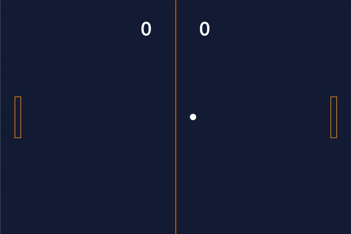
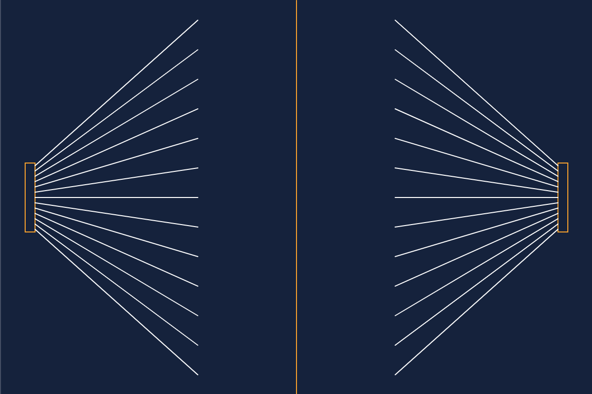

# Pong

### A 2-player game of Pong

How to play:

-   Left player uses "a" and "z" to move up and down
-   Right player uses "k" and "m" to move up and down
-   The ball reflects at an angle depending on the location it hits the paddle

---

### Gameplay

---

### Reflections

The lines represent the direction the ball would reflect given the location it hits the paddle

